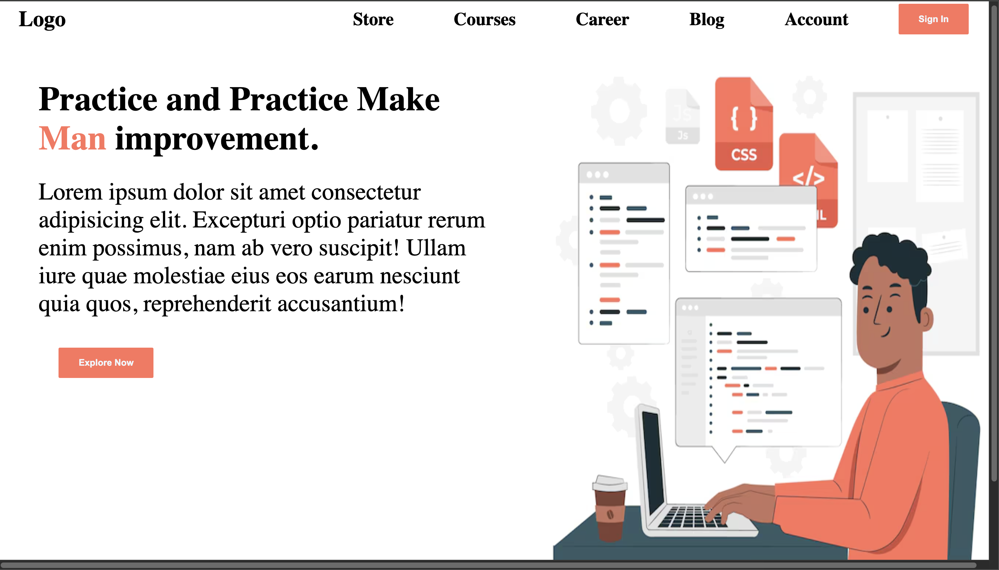
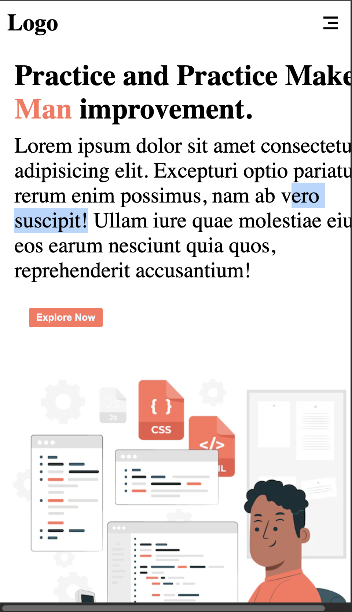

# Responsive Page 
A front-end web layout designed to adapt perfectly across different screen sizes .

## Visual Preview 

## Tech Stack Used
 * HTML5 (Semantic Structure)
 * CSS3 (Media queries/Flexbox/Grid Layouts)